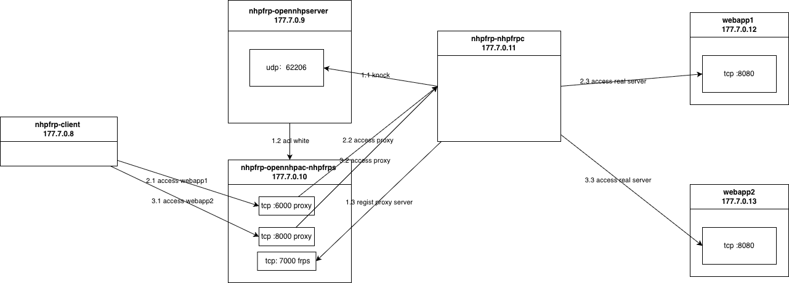

## poc部署网络示意图

### 容器配置
| Container Name           | IP            | 端口监听                       | Description                                                                                                                 |
| ------------------       | ------------  | -------------------------------| --------------------------------------------------------------------------------------------------------------------------- |
| nhpfrp-client            | 177.7.0.8     |                -               | 模拟客户端，通过 nhp-frp 访问代理的 Web 服务                                                                                |
| nhpfrp-opennhpserver     | 177.7.0.9     |              62206             | 敲门服务器（Port Knocking Server），负责处理敲门协议                                                                        |
| nhpfrp-opennhpac-nhpfrps | 177.7.0.10    |  6000, 8000 (代理) 7000 (frps)	| OpenNHP-AC 与 NHP-FRPS 的组合  ， OpenNHP-AC：默认禁止所有访问，NHP-FRPS：Frp 服务端                                        |
| nhpfrp-nhpfrpc           | 177.7.0.11    |                —               | nhp-frpc，内置nhp-agent。通过敲门协议和opennhpserver交互，使nhpfrp-opennhpac-nhpfrps允许被nhpfrp-nhpfrpc和nhpfrp-client访问 |
| web-app1                 | 177.7.0.12    |              8080              | Web 服务器 1，仅允许 nhp-frpc 直接访问                                                                                      |
| web-app2                 | 177.7.0.13    |              8080              | Web 服务器 2，仅允许 nhp-frpc 直接访问                                                                                      |

### 网络架构示意图

## 验证测试

### 构建基础镜像
`docker build --no-cache -t opennhp-base:latest -f Dockerfile.base ../..`

### 启动 POC 环境
`docker compose up -d`

### 访问代理服务器
`docker exec -it nhpfrp-client bash`

`curl 177.7.0.10:6000`

`curl 177.7.0.10:8000`
